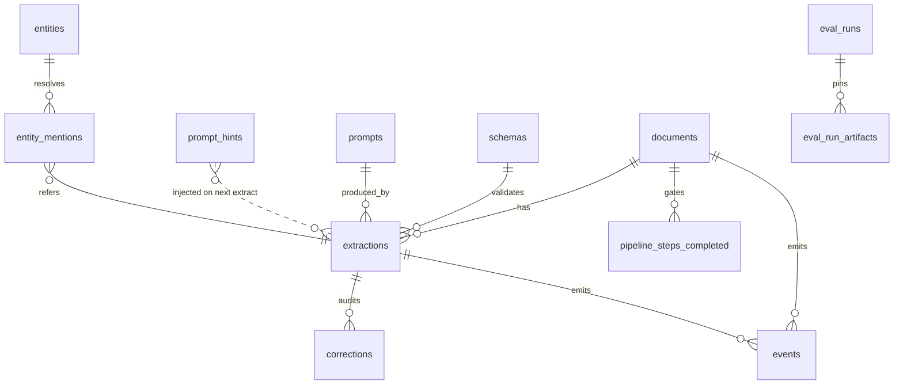
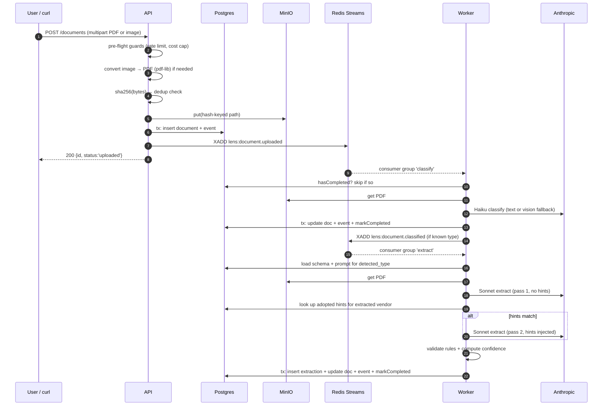
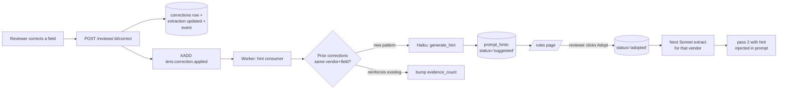
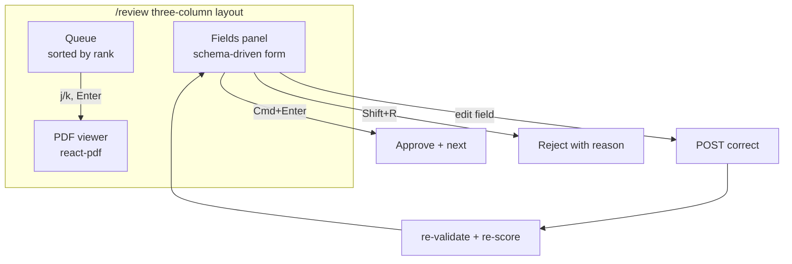

# Decisions

A running log of the architectural calls made while building Lens. Skips the
bug-fix churn; keeps the reasoning and the trade-offs.

---

## Scope

Turn messy invoices and receipts into structured, queryable data — with a
learning loop that makes the extractor better each time a reviewer corrects it.

The user I'm building for is **Priya**, a controller processing ~300 vendor
invoices a month by hand. Her job is copy-paste with costly downside on
mistakes. The product's job is to auto-process everything it can, surface
only the uncertain ones for review, and get visibly better every time she
corrects something.

Scope covers: uploads (PDF and image), fixed-schema extraction, a review
workspace, a rule-learning loop, an eval harness that catches regressions
before they merge, and enough observability to see how it's behaving. Not
scoped: auth, multi-tenancy, generic text-to-SQL.

---

## Foundation

### Stack

- **Node 22 + TypeScript** everywhere. Familiar territory; the risk budget
  is better spent on the pipeline than on relearning the runtime. Go was
  considered and passed on — stable system first, optimizations later.
- **Fastify + Zod** on the API. Every route touches a schema; typed schema
  provider gives that with no glue code.
- **Drizzle ORM** over Prisma. Keeps SQL close, migrations are plain SQL
  files reviewers can read. Prisma's generator step doesn't earn its keep
  here.
- **Redis Streams** as the message queue (see below).
- **pnpm workspaces** to share `@lens/db`, `@lens/pipeline`, `@lens/llm`,
  `@lens/queue`, `@lens/storage` across the api / worker / web / evals apps.
- **shadcn + Tailwind v4** on the frontend. Reviewers know shadcn; the
  "hand-crafted" signal doesn't pay for the days it costs. Time saved goes
  into the review workspace and rules flow.
- **Docker images only in this repo** — the infra repo owns k8s manifests,
  ArgoCD, TLS. Two-repo boundary matches how real teams split product from
  platform.

### Redis Streams over Kafka or BullMQ

Kafka is right for scale but wrong for a 10-day build; operational overhead
is unjustified here. BullMQ hides `XCLAIM` and reprocessing semantics that
matter to demonstrate. Raw Redis Streams gives us stream + consumer group +
delivery-count as first-class primitives. Persistence to disk is on if we
ever need retention.

### Do we even need a queue?

At this scale the API could handle extraction in the same request cycle. But
Sonnet calls run 10-20s each, and we want to iterate on the pipeline
independently of the API's lifecycle. Separation-of-concerns now, before it
becomes painful.

---

## Data model

Compact reference:



### Fixed schemas as versioned files

- Schemas live at `domains/<type>/schema.yaml` — invoice, receipt.
- Started as a compatible subset of DocILE for lineage; product-friendly
  names (`total`, `invoice_date`) over academic ones (`amount_total_gross`).
- The API upserts them into `schemas` on startup. Every extraction FKs to
  the exact schema version that produced it, so a schema change never
  silently invalidates historical extractions.

### Prompts as versioned files

- `pipeline/prompts/<name>.v<n>.md` with YAML front-matter (`name`,
  `version`, `model`, `temperature`).
- Same upsert-on-startup pattern as schemas. `extractions.prompt_id` pins
  the exact prompt version used.
- Files, because prompts are engineering artifacts — they get diffed and
  PR-reviewed. Not string literals in code.

### Extractions are mutable, corrections are immutable

- `extractions` is the current-state row. Reviewer corrections update the
  row in place; `version` column tracks concurrent-edit conflicts.
- `corrections` is the append-only audit trail with old/new value and
  correction author.
- Alternative was full versioned extractions via `parent_extraction_id`
  chains — dropped as ceremony for something no UI actually reads.

### Events for durable execution, plus a dedicated idempotency table

- `events` is append-only, one row per state transition, in the same
  transaction as the domain write.
- `pipeline_steps_completed` gates handler retries. UNIQUE
  `(document_id, step_name)` protects against replay AND concurrent workers.
  Inserted inside the domain transaction so a crash between commit and
  marker can't leave duplicate work.
- They look overlapping but answer different questions: events say "what
  happened," `pipeline_steps_completed` says "should this handler run now."

### Should prompts/schemas live in the DB at all?

Files are source of truth. The DB copy earns its keep by giving us a FK
target on `extractions` (so `JOIN prompts USING prompt_id` gives you the
exact prompt text without a git spelunk), plus portability of the full
audit story via a DB dump. At submission scale it's arguably overkill; at
real scale (many prompt versions, many extractions) it pays out.

---

## Extraction pipeline



### Classify with vision fallback

`pdf-parse` extracts text from the first pages. If text is shorter than
100 chars (image-only PDF, scanned, or an image we wrapped at ingest),
we send the PDF pixels to Haiku as a `document` content block. Same code
path either way — vision handles the low-text case without a separate
model.

### Extract in one pass, or two when hints exist

- Pass 1 always runs, no hints. Needed because we can't look up
  vendor-scoped hints until we know the vendor.
- If adopted hints match `normalizeVendor(extracted.vendor_name)`, we
  extract again with hints in the prompt and keep pass 2's output.
- Doubles cost only for vendors the reviewer has explicitly invested in.

### Image support: convert-to-PDF at ingest

PNG/JPEG → wrapped in a single-page PDF via `pdf-lib` at upload time.
Storage, classify, extract, review, PDF viewer all speak PDF — one
normalization at the door means downstream code stays uniform.

### Dedup by SHA256, not filename

`documents.file_hash` is UNIQUE. Two vendors both naming a file
`invoice-2025-04.pdf` are fine — different bytes, different hashes. The
gap: a rescanned invoice or a PNG re-uploaded as JPEG are different bytes,
so they'd end up as duplicates. Content-aware dedup (text digest) is a
roadmap item.

---

## Confidence, validation, reconciliation

### Confidence signals over model self-report

Model-reported confidence is uncalibrated. Instead, per-field confidence
is a weighted sum of four structural signals:

| Signal | Weight |
|---|---|
| type_match (does the value parse as the declared type?) | 0.30 |
| required_present (if required, is it non-null?) | 0.30 |
| rules_passed (fraction of rules touching this field that passed) | 0.25 |
| pattern_match (if a regex pattern is declared, does it match?) | 0.15 |

Weights renormalize when a signal doesn't apply. Overall confidence is
`min(per_field)` — the weakest link. One missing required field must
block auto-approve; averaging would hide that.

### Validation rules live in the schema

Each schema has a `validations:` block with rules like
`abs(subtotal + tax + shipping - discount - total) < 0.01`. Rules also
carry `applies_if`, `severity`, and a `suggests: {field, value}` clause
that pre-computes the value that would satisfy the rule. That's the
foundation of the reconciliation UX below.

The engine evaluates expressions inside a sandboxed `new Function` with
pre-filled null for schema-declared fields (so a missing key never
throws). Rules are author-controlled schema.yaml text, not user input.

### The reconciliation UX pivot

Original plan showed `Confidence: 63%` next to a field. Better: show
**why** we distrust it — the exact rule that fired and the value that
would satisfy it.

```
TOTAL: 4585.49
⚠ Subtotal + tax does not equal total.
    Rule expects: 4759.20      [Accept suggested value]
```

Changes review from "do I trust this number" to "do I trust this
reconciliation." Lower cognitive load, higher throughput, transparent
reasoning. Priya sees the system's logic instead of a percentage she has
to interpret.

### "N required missing" isn't the same as "extractor failed"

A doc where the extractor got 5 of 7 fields right and missed 2 required
ones should NOT render as "0% confidence" in the header. It renders as
`[2 REQUIRED MISSING] 100% on the rest`. Two failure modes, two visual
signals.

---

## The learning loop (flagship)

The core of the product: reviewer corrections turn into vendor-scoped
rules that improve future extractions, human-approved before they take
effect.



### Why synthesize a rule instead of passing raw corrections

The alternative would be to just inject prior corrections into the
extraction prompt: "the reviewer previously changed 4759.20 → 4585.49."
Simple, one LLM call.

Why the synthesis + human-approval step exists:

- **Corrections are events, rules are patterns.** Ten edits might imply a
  rule; one usually doesn't. The synthesizer's job is to recognize the
  pattern once, so Sonnet doesn't re-derive it on every extraction.
- **Token cost.** A vendor with 20 prior corrections would ship 20
  pairs into every future extraction prompt. A synthesized rule is one
  sentence, forever.
- **Human agency.** Finance users don't want a system that silently
  rewrites how it interprets their invoices. Adopt / Ignore / Modify is
  the point — the reviewer sees the rule text before it takes effect.
- **Contradictions get caught.** When corrections oscillate, the LLM
  prompt has an "inconsistent signal → empty hint" guardrail. Raw
  injection would just confuse the extractor.

### Learning scope: strictly per-vendor, per-document-type

Every hint is keyed on `(document_type, matching_key, field_path)` where
`matching_key = normalizeVendor(vendor_name)`. A rule for Vendor A can
NEVER fire on Vendor B, and a rule for `invoice` never applies to
`receipt`. Cross-vendor generalization comes from the schema's
validations block (which applies to every document of that type).

Safer default. Cross-vendor promotion is a roadmap item: a job that
watches for N similar per-vendor hints on the same field and suggests a
schema-level rule.

---

## Eval harness

If you can't measure it, you can't improve it. The eval harness gives
"did the last change make things better or worse" a number.

### Fixtures

One fixture = one directory:

```
evals/fixtures/<id>/
    input.pdf         ← the invoice to test against
    expected.yaml     ← ground truth in the schema shape
    metadata.yaml     ← source, currency, features
```

Corpus is a mix: 5 synthetic invoices generated by pdfkit (pristine ground
truth we control) + 1 real DocILE-imported fixture (real-world messiness
we don't). Synthetic tells us if a change silently broke happy paths; real
tells us if it broke edge cases.

### Comparison

Field-type-aware: strings normalized (lowercase, strip punctuation), money
within 0.01, dates ISO-exact, line items greedy-aligned by Jaccard on the
`description` field. Per-field binary correct/not → per-fixture F1 →
corpus F1. Binary is what a controller actually cares about (either the
total is right or it isn't).

### Cache

`evals/.cache/<sha256(model+temperature+system+messages)>.json`. Cache
hit returns the stored `LlmResult` with cost zeroed so reports only
reflect real spend. Prompt / schema / model changes invalidate the key
naturally. Second run on unchanged inputs costs $0.

### PR-blocking regression gate

`.github/workflows/eval.yml` runs on PRs touching prompts, schemas, or
the pipeline. Blocks merge on any fixture F1 drop > 0.02. Posts the
markdown report as a sticky comment (marker-based, updates in place
across pushes).

The gate has caught real regressions during this build — most notably
when I bumped `extract_invoice` v1 → v2 without re-running fixtures, and
two synthetic fixtures went from 1.000 → 0.900 because the extractor
correctly moved shipping out of `line_items` into `shipping_amount` but
the fixtures still expected shipping inside line_items. Update fixtures,
new baseline.

---

## Review workspace



### Keyboard-first, but shortcuts that don't hijack the browser

- `j`/`k` and arrows: move in queue
- `Enter`: open selected
- Click field → `e`/`Enter`: enter edit mode
- `Enter`: commit; `Esc`: cancel
- `Cmd/Ctrl + Enter`: approve
- `Shift + R`: reject with reason
- `[`/`]`: PDF page nav; `+`/`-`: zoom

Deliberately avoided `Cmd+R` (browser reload) and `Cmd+E` (find-in-page
on some builds). Bare-letter shortcuts with a global check that focus
isn't in an input give muscle-memory speed without stepping on browser
defaults.

### PDF proxied through the API, not presigned from storage

`GET /documents/:id/pdf` streams from MinIO. Presigned URLs would need
CORS on the bucket, refresh dance for long review sessions, and would
leak storage details to the browser. Proxy is one route, one auth
surface, cache-control keeps sessions snappy.

---

## Vendor arc — the closing screen

`/vendors/:vendor` is the demo screenshot. Shows a single vendor's
touchless-processing rate week-over-week plus "corrections that stuck" —
per-field before/after adoption counts.

Anchoring the before/after around the rule adoption moment answers the
key question directly: **did the human's rule make the system better?**
Time-window cuts (e.g. "last 30 days") would conflate rule adoption with
whatever else happened that week.

**Touchless** is auto-approved only, not auto-approved + human-approved.
An earlier bug summed both, giving one vendor 200% touchless. Touchless
should honestly mean "no human touched it" — human-approved isn't
touchless, it's just fast review.

---

## Query surface

Two tabs at `/query`:

1. **Insights** — 6 pre-baked SQL queries as `.sql` files. Analysts add
   queries by adding files, not code. Adding an insight is a git-diff, not
   a deploy.
2. **SQL console** — Monaco editor + schema browser + Run button.

Both go through the same `POST /query/run` endpoint. Every query runs
inside a transaction that does `SET LOCAL statement_timeout = 5s` and
`SET LOCAL transaction_read_only = ON` first. Any DDL/DML fails with a
machine-readable code (`read_only_violation`, `timeout`, `syntax_error`).

Chose the transaction-flag approach over a separate read-only PG role
because it's stronger enforcement, doesn't need managing a second
credential, and works for any query shape including CTEs.

The console proves the actual thesis of the problem — "structured,
queryable data" — as a demonstrable surface. Pre-baked queries alone
would be a "trust us it's queryable" claim.

---

## Guardrails on a public URL

The deployed URL is passwordless. Two hard stops before uploads hit the
LLM path:

- **Per-IP rate limit** via `@fastify/rate-limit`, scoped to
  `POST /documents` only. Default 30 uploads / IP / hour.
- **Daily cost cap** — `checkCostGuard()` sums the last 24h of
  `extractions.cost_usd` before every upload. 503 with `code:
  'cost_cap_reached'` if the cap is hit. A doc that never enters the
  stream never bills.
- **Upload size cap** 50 MB, enforced by chunked read.
- **Retry cap** 2 attempts per queue message. Poison messages
  dead-letter to `documents.status='failed'` with a `document.failed`
  event, instead of retrying forever and burning LLM cost. Real bug
  I hit during dev: a validator ReferenceError caused a message to
  retry every 60s and cost stacked up.

---

## Observability

Documented in `TELEMETRY.md` as a plan, not built yet. Split of
concerns: metrics/spans/logs live in this repo; dashboards/alerts/OTLP
collector live in the infra repo. OpenTelemetry SDK + Prometheus scrape
endpoint + pino → Loki via pod stdout.

Priority when we pick it up: `prom-client` on the LLM cost/token
counters first (answers "how much are we spending today" without a DB
query), auto-instrumentation for traces second.

---

## Deliberate cuts

Named up front so the roadmap doesn't relitigate them.

- **Text-to-SQL** — pre-baked queries + Monaco cover the demand.
- **Multi-tenant** — single deployment; scope is the reviewer.
- **Auth** — daily $ cap + IP rate limit are the guardrails.
- **Bounding-box overlay** — Sonnet-returned bboxes hallucinate; a
  broken overlay undermines trust more than no overlay.
- **Cross-check confidence signal via a second LLM call** — doubles
  cost for a signal our other four already give us.
- **pgvector entity resolution** — normalized exact-match + pg_trgm
  covers the review flow. Embeddings are roadmap.
- **Fully autonomous rule adoption** — the whole point of the
  human-approval step is that the system doesn't silently rewrite
  itself. Auto-adopt is a roadmap item gated on a lot more evidence than
  we have.
- **In-repo Grafana / LGTM** — infra repo owns observability; this repo
  exposes `/metrics` and OTLP.
