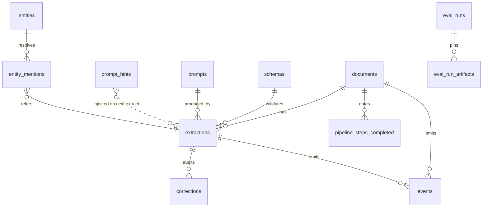
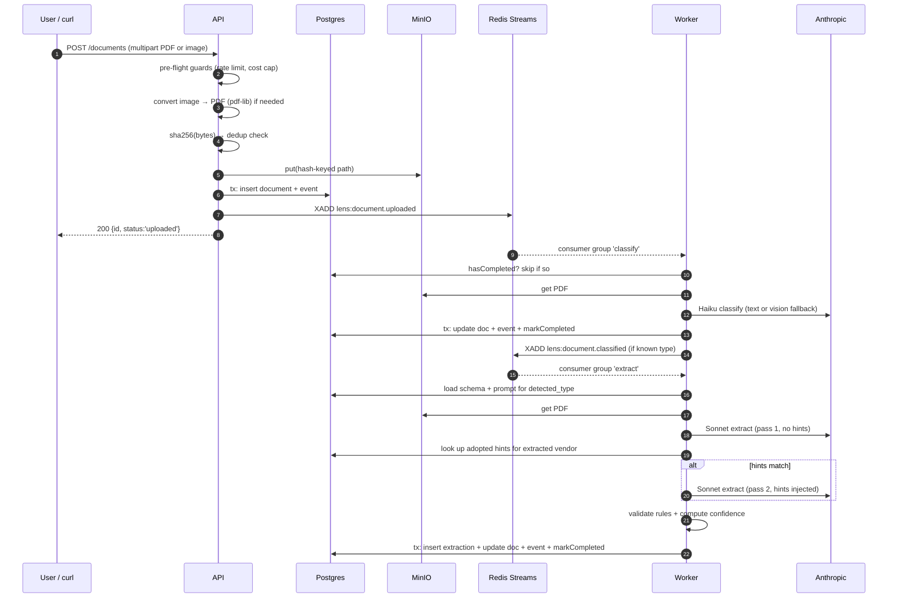
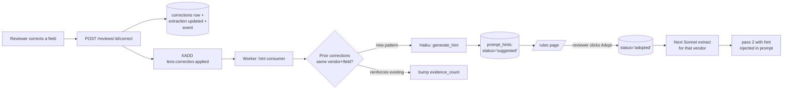
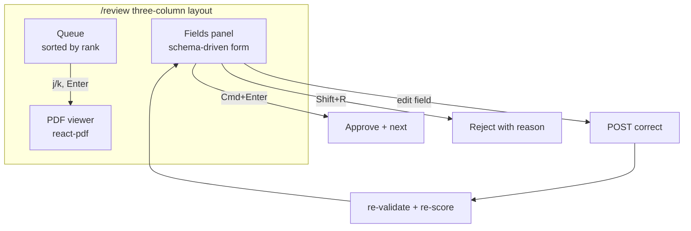

# Decisions

A running log of the architectural calls made while building Lens. Skips
the bug-fix churn; keeps the reasoning and the trade-offs.

---

## Scope

Turn messy invoices and receipts into structured, queryable data — with a
learning loop that makes the extractor better each time a reviewer corrects
it. Two document types (invoice, receipt), a review workspace, a
rule-learning loop, an eval harness that catches regressions before they
merge, an insight + SQL surface for downstream analysis, and enough
observability to see how it behaves. Not scoped: auth, multi-tenancy,
generic text-to-SQL, receipts / bank statements beyond the demo.

---

## Language & runtime

**Node 22 LTS + TypeScript everywhere** — API, worker, web, evals, shared
packages.

- Node over Go: I know Node's quirks and event-loop behavior well.
  Building a stable system first, optimizing later — Go's compile-time
  strictness and native concurrency are advantages I'd trade for velocity
  on a 10-day build. Would consider Go for the worker specifically if we
  had P99 latency problems the pipeline couldn't solve any other way.
- Node over Python: pipeline code is I/O and orchestration heavy, not
  numeric. TypeScript across FE + BE saves a language boundary. Python's
  ML tooling isn't needed here (we hit hosted LLMs).
- **TypeScript strict + `exactOptionalPropertyTypes`** — catches "did I
  really mean undefined vs. missing?" bugs that JavaScript and looser TS
  ship silently.

## LLM provider: Anthropic (Sonnet + Haiku)

Two models, one provider. Assignment framing wanted responsible use of
LLMs — cost-tiered by task fit is that:

- **Haiku 4.5** for classify and hint generation. Small, cheap (~$0.001
  per classify, ~$0.0007 per hint), fast (~1-2s). Both tasks are one-shot
  short outputs where a bigger model is wasted spend.
- **Sonnet 4.6** for extraction. PDF vision quality matters — invoices
  have varied layouts and Sonnet reads them reliably. Extraction outputs
  are longer JSON where the marginal quality of the larger model justifies
  the ~$0.02 per doc.

Why Anthropic over OpenAI:

- **Native PDF vision** as a `document` content-type — no rasterization
  step on our side, no per-page image blob juggling. GPT-4o requires
  splitting PDFs into pages and sending each as an image.
- **JSON-mode-adjacent strictness** with prompt instructions has been
  reliable enough that we can enforce shape via the prompt + defensive
  unwrap (the "wrapped under `fields`" bug I hit and fixed).
- Consistent behavior on structured extraction across the two model
  tiers; I don't have to re-prompt when going between Haiku and Sonnet.

Why not Gemini:

- Vision + document support is competitive, but the tool-use / structured
  output story is younger and I've hit edge cases (JSON leakage into
  markdown) in past use. Not worth the risk on a 10-day build.

Why not a mix (Gemini for cheap, Anthropic for extract):

- Two SDKs, two auth stories, two rate-limit patterns, two cost tables.
  Single provider keeps the ops surface small. If cost or quality
  arguments changed I'd revisit — the `@lens/llm` interface is a thin
  wrapper for exactly this reason.

## Data store: PostgreSQL

- **Postgres** because JSONB gives us schema-flexible extraction storage
  (`extractions.extracted_json`), a real query planner for the SQL console
  (Monaco tab needs performance), and future room for `pgvector` when we
  do embeddings-based entity resolution.
- Not MongoDB / other doc stores: we DO have relational needs — extractions
  → schemas, extractions → prompts, corrections → extractions, events →
  aggregates. FK integrity is real value.
- Not SQLite: single-node, no concurrent-worker story.

## ORM: Drizzle

- Migrations are plain SQL files that go through PR review. No hidden
  generator step.
- TypeScript inference is real: the schema types flow into query results
  without a codegen step.
- `Prisma` was the other option — heavier, hides the SQL, its migration
  DSL is opinionated in ways that don't help me. Its type-generation step
  adds a build-time contract I'd rather not have.
- Raw `postgres` client alone would work but lose the shared type story
  across api/worker/evals.

## Queue: Redis Streams

- Kafka is right for scale but wrong for a 10-day build. Operational
  overhead (ZooKeeper or KRaft, brokers, topics, ACLs) is unjustified at
  our message volume.
- `BullMQ` (Redis-based) would work but hides `XCLAIM`, delivery-count,
  consumer-group semantics. I want those visible because the flagship
  learning loop depends on knowing when a message has been retried.
- Redis Streams gives stream + consumer group + delivery-count as
  first-class primitives. Native `XPENDING` / `XCLAIM` / `XAUTOCLAIM` map
  cleanly to "reclaim orphaned messages after N seconds idle."
- Do we even need a queue? At this scale the API could handle extraction
  in the same request cycle. But Sonnet calls run ~10-20s each, and I
  want to iterate on the pipeline independently of the API's lifecycle.
  Separation-of-concerns now, before it becomes painful.
- Redis persistence-to-disk (AOF) is on if we ever need retention beyond
  process lifetime. Would pivot to Kafka only if we grow to multi-region
  or need weeks of message history.

## API framework: Fastify

- Fastify + `fastify-type-provider-zod`. Every route touches a schema
  (upload validation, review corrections, rules mutations) — typed schema
  provider gives it with no glue code.
- Not Express: no first-class validation story, plugin ecosystem is
  older/inconsistent.
- Not Hono: excellent but its Node-adapter story is younger, and I'm not
  targeting edge runtimes.

## Frontend framework: Vite + React + shadcn

- **Vite** over Next.js: we're an SPA with a proxied API. No SSR
  requirement, no server-component story needed. Vite's dev-server HMR is
  the fastest iteration loop for this kind of app.
- **React** over Svelte / SolidJS: not the differentiating decision here.
  React's ecosystem (react-pdf, react-dropzone, TanStack Query) is what
  I'd end up wanting anyway.
- **shadcn/ui** over Chakra / MUI / Mantine / bespoke:
  - shadcn ships primitives you copy into your codebase. You own the code,
    you can edit it, no upgrade risk from a vendor's breaking release.
    Chakra / MUI ship as dependencies — you're on their upgrade treadmill
    and locked into their design tokens.
  - Reviewers know shadcn. The "hand-crafted from Radix + Tailwind"
    signal doesn't pay for the days it costs, and shadcn IS Radix +
    Tailwind, just with the boring wiring done.
  - Bespoke design system: I'd need one anyway (buttons, dialogs,
    tooltips, tables), and building it during a 10-day build is time
    stolen from the flagship.
- **Tailwind v4** over v3: CSS-first config, one less config file, faster
  builds. Beta but the API is frozen; shadcn officially supports it.
- **TanStack Query** for server state — cache/refetch/mutation semantics
  match what we need for review workflows. Redux would be overkill; SWR
  is thinner but TanStack's `select` and mutation model are cleaner for
  the correction/adopt flows.
- **React Router v6** over TanStack Router — ubiquitous, less setup,
  shadcn examples assume it. Would pick TanStack Router if we wanted
  typed params.
- **react-pdf** for the review workspace PDF viewer. Battle-tested,
  bundles a known pdfjs. Alternative was rolling our own PDF.js
  integration — same code we'd write, more bugs.
- **react-dropzone** for upload — headless, ~10KB, standard. Alternative
  was hand-rolling `<input type="file">` with drag handlers; not worth
  the LOC.
- **Monaco editor** for the SQL tab — same editor VS Code uses. SQL
  syntax highlighting out of the box. CodeMirror was the other option;
  Monaco has broader familiarity.
- **shadcn `sonner`** for toasts — small footprint, works with Radix
  patterns already in the codebase.

## Package management: pnpm workspaces

- Fast, disk-efficient, native workspace support.
- Not npm workspaces: pnpm's hoisting is stricter, catches phantom
  dependencies.
- Not Bun: Bun's Node compat isn't universal (Drizzle Kit, pdf-parse have
  edges). Would cost debugging time.
- Not Turborepo: adds a config surface and caching I don't need at 8
  workspaces. Plain pnpm scripts do the job.

## Deploy target: Docker images, k8s lives elsewhere

- This repo builds and publishes multi-arch container images (api, web,
  worker) to GHCR on CI. The infra repo owns k8s manifests, ArgoCD
  Applications, TLS, secrets.
- Two-repo boundary matches how real teams split product from platform.
  Keeps this repo focused on the product; keeps the infra repo the single
  source of truth for deploy config.

---

## Data model

Compact reference:



### Fixed schemas as versioned files

- Schemas live at `domains/<type>/schema.yaml` — one file per document
  type (invoice, receipt).
- Started as a compatible subset of DocILE for lineage; product-friendly
  names (`total`, `invoice_date`) over academic ones (`amount_total_gross`).
- The API upserts them into `schemas` on startup. Every extraction FKs
  to the exact schema version that produced it, so a schema change never
  silently invalidates historical extractions.

### Prompts as versioned files

- `pipeline/prompts/<name>.v<n>.md` with YAML front-matter (`name`,
  `version`, `model`, `temperature`).
- Same upsert-on-startup pattern as schemas. `extractions.prompt_id` pins
  the exact prompt version used.
- Files because prompts are engineering artifacts — they get diffed and
  PR-reviewed. Not string literals in code.

### Extractions mutable, corrections immutable

- `extractions` is the current-state row. Reviewer corrections update the
  row in place; `version` column tracks concurrent-edit conflicts.
- `corrections` is the append-only audit trail with old/new value and
  correction author.
- Alternative was full versioned extractions via `parent_extraction_id`
  chains — dropped as ceremony for something no UI actually reads.

### Events for durable execution, plus a dedicated idempotency table

- `events` is append-only, one row per state transition, in the same
  transaction as the domain write.
- `pipeline_steps_completed` gates handler retries. UNIQUE
  `(document_id, step_name)` protects against replay AND concurrent
  workers. Inserted inside the domain transaction so a crash between
  commit and marker can't leave duplicate work.
- They look overlapping but answer different questions: events say "what
  happened," `pipeline_steps_completed` says "should this handler run now."

### Should prompts/schemas live in the DB at all?

Files are source of truth. The DB copy earns its keep by giving us a FK
target on `extractions` (so `JOIN prompts USING prompt_id` gives you the
exact prompt text without a git spelunk), plus portability of the full
audit story via a DB dump. At submission scale it's arguably overkill; at
real scale (many prompt versions, many extractions) it pays out.

---

## Extraction pipeline



### Classify with vision fallback

`pdf-parse` extracts text from the first pages. If text is shorter than
100 chars (image-only PDF, scanned, or an image we wrapped at ingest),
we send the PDF pixels to Haiku as a `document` content block. Same code
path either way — vision handles the low-text case without a separate
model.

### Extract in one pass, or two when hints exist

- Pass 1 always runs, no hints. Needed because we can't look up
  vendor-scoped hints until we know the vendor.
- If adopted hints match `normalizeVendor(extracted.vendor_name)`, we
  extract again with hints in the prompt and keep pass 2's output.
- Doubles cost only for vendors the reviewer has explicitly invested in.

### Image support: convert-to-PDF at ingest

PNG/JPEG → wrapped in a single-page PDF via `pdf-lib` at upload time.
Storage, classify, extract, review, PDF viewer all speak PDF — one
normalization at the door means downstream code stays uniform.

### Dedup by SHA256, not filename

`documents.file_hash` is UNIQUE. Two different files sharing a filename
are fine — different bytes, different hashes. The gap: a rescanned
invoice or a PNG re-uploaded as JPEG are different bytes, so they'd end
up as duplicates. Content-aware dedup (text digest) is a roadmap item.

---

## Confidence, validation, reconciliation

### Confidence signals over model self-report

Model-reported confidence is uncalibrated. Instead, per-field confidence
is a weighted sum of four structural signals:

| Signal | Weight |
|---|---|
| type_match (does the value parse as the declared type?) | 0.30 |
| required_present (if required, is it non-null?) | 0.30 |
| rules_passed (fraction of rules touching this field that passed) | 0.25 |
| pattern_match (if a regex pattern is declared, does it match?) | 0.15 |

Weights renormalize when a signal doesn't apply. Overall confidence is
`min(per_field)` — the weakest link. One missing required field must
block auto-approve; averaging would hide that.

### Validation rules live in the schema

Each schema has a `validations:` block with rules like
`abs(subtotal + tax + shipping - discount - total) < 0.01`. Rules also
carry `applies_if`, `severity`, and a `suggests: {field, value}` clause
that pre-computes the value that would satisfy the rule. That's the
foundation of the reconciliation UX below.

The engine evaluates expressions inside a sandboxed `new Function` with
pre-filled null for schema-declared fields (so a missing key never
throws). Rules are author-controlled schema.yaml text, not user input.

### The reconciliation UX

Original plan showed `Confidence: 63%` next to a field. Better: show
**why** we distrust it — the exact rule that fired and the value that
would satisfy it.

```
TOTAL: 4585.49
⚠ Subtotal + tax does not equal total.
    Rule expects: 4759.20      [Accept suggested value]
```

Changes review from "do I trust this number" to "do I trust this
reconciliation." Lower cognitive load, higher throughput, transparent
reasoning. Shows the system's logic instead of a percentage that has to
be interpreted.

### "N required missing" isn't the same as "extractor failed"

A doc where the extractor got 5 of 7 fields right and missed 2 required
ones should NOT render as "0% confidence" in the header. It renders as
`[2 REQUIRED MISSING] 100% on the rest`. Two failure modes, two visual
signals.

---

## The learning loop (flagship)

The core of the product: reviewer corrections turn into vendor-scoped
rules that improve future extractions, human-approved before they take
effect.



### Why synthesize a rule instead of passing raw corrections

The alternative would be to inject prior corrections into the extraction
prompt directly: "previously changed 4759.20 → 4585.49." Simple, one LLM
call.

Why the synthesis + human-approval step exists:

- **Corrections are events, rules are patterns.** Ten edits might imply
  a rule; one usually doesn't. The synthesizer's job is to recognize the
  pattern once, so Sonnet doesn't re-derive it on every extraction.
- **Token cost.** A vendor with 20 prior corrections would ship 20 pairs
  into every future extraction prompt. A synthesized rule is one
  sentence, forever.
- **Human agency.** Finance systems don't get silent behavior changes.
  Adopt / Ignore / Modify is the point — the reviewer sees the rule text
  before it takes effect.
- **Contradictions get caught.** When corrections oscillate, the LLM
  prompt has an "inconsistent signal → empty hint" guardrail. Raw
  injection would just confuse the extractor.

### Learning scope: strictly per-vendor, per-document-type

Every hint is keyed on `(document_type, matching_key, field_path)` where
`matching_key = normalizeVendor(vendor_name)`. A rule for Vendor A can
NEVER fire on Vendor B, and a rule for `invoice` never applies to
`receipt`. Cross-vendor generalization comes from the schema's
validations block (which applies to every document of that type).

Safer default. Cross-vendor promotion is a roadmap item: a job that
watches for N similar per-vendor hints on the same field and suggests a
schema-level rule.

---

## Eval harness

If you can't measure it, you can't improve it. The eval harness turns
"did the last change make things better or worse" into a number.

### Fixtures

One fixture = one directory:

```
evals/fixtures/<id>/
    input.pdf         ← the invoice to test against
    expected.yaml     ← ground truth in the schema shape
    metadata.yaml     ← source, currency, features
```

Corpus is a mix: 5 synthetic invoices generated by pdfkit (pristine
ground truth we control) + 1 real DocILE-imported fixture (real-world
messiness we don't). Synthetic tells us if a change silently broke happy
paths; real tells us if it broke edge cases.

### Comparison

Field-type-aware: strings normalized (lowercase, strip punctuation),
money within 0.01, dates ISO-exact, line items greedy-aligned by Jaccard
on the `description` field. Per-field binary correct/not → per-fixture
F1 → corpus F1. Binary matches how a reviewer thinks about a field —
either the total is right or it isn't.

### Cache

`evals/.cache/<sha256(model+temperature+system+messages)>.json`. Cache
hit returns the stored `LlmResult` with cost zeroed so reports only
reflect real spend. Prompt / schema / model changes invalidate the key
naturally. Second run on unchanged inputs costs $0.

### PR-blocking regression gate

`.github/workflows/eval.yml` runs on PRs touching prompts, schemas, or
the pipeline. Blocks merge on any fixture F1 drop > 0.02. Posts the
markdown report as a sticky comment (marker-based, updates in place
across pushes).

The gate has caught real regressions during this build — most notably
when I bumped `extract_invoice` v1 → v2 without re-running fixtures, and
two synthetic fixtures went from 1.000 → 0.900 because the extractor
correctly moved shipping out of `line_items` into `shipping_amount` but
the fixtures still expected shipping inside line_items. Update fixtures,
new baseline.

---

## Review workspace



### Keyboard-first, but shortcuts that don't hijack the browser

- `j`/`k` and arrows: move in queue
- `Enter`: open selected
- Click field → `e`/`Enter`: enter edit mode
- `Enter`: commit; `Esc`: cancel
- `Cmd/Ctrl + Enter`: approve
- `Shift + R`: reject with reason
- `[`/`]`: PDF page nav; `+`/`-`: zoom

Deliberately avoided `Cmd+R` (browser reload) and `Cmd+E` (find-in-page
on some builds). Bare-letter shortcuts with a global check that focus
isn't in an input give muscle-memory speed without stepping on browser
defaults.

### PDF proxied through the API, not presigned from storage

`GET /documents/:id/pdf` streams from MinIO. Presigned URLs would need
CORS on the bucket, refresh dance for long review sessions, and would
leak storage details to the browser. Proxy is one route, one auth
surface, cache-control keeps sessions snappy.

---

## Vendor arc — the closing screen

`/vendors/:vendor` is the demo screenshot. Shows a single vendor's
touchless-processing rate week-over-week plus "corrections that stuck" —
per-field before/after adoption counts.

Anchoring the before/after around the rule adoption moment answers the
key question directly: **did the human's rule make the system better?**
Time-window cuts (e.g. "last 30 days") would conflate rule adoption with
whatever else happened that week.

**Touchless** is auto-approved only, not auto-approved + human-approved.
An earlier bug summed both, giving one vendor 200% touchless. Touchless
should honestly mean "no human touched it" — human-approved isn't
touchless, it's just fast review.

---

## Query surface

Two tabs at `/query`:

1. **Insights** — 6 pre-baked SQL queries as `.sql` files. Analysts add
   queries by adding files, not code. Adding an insight is a git-diff,
   not a deploy.
2. **SQL console** — Monaco editor + schema browser + Run button.

Both go through the same `POST /query/run` endpoint. Every query runs
inside a transaction that does `SET LOCAL statement_timeout = 5s` and
`SET LOCAL transaction_read_only = ON` first. Any DDL/DML fails with a
machine-readable code (`read_only_violation`, `timeout`, `syntax_error`).

Chose the transaction-flag approach over a separate read-only PG role
because it's stronger enforcement, doesn't need managing a second
credential, and works for any query shape including CTEs.

The console demonstrates the actual thesis — "structured, queryable
data" — as an operable surface. Pre-baked queries alone would be a
"trust us it's queryable" claim.

---

## Guardrails on a public URL

The deployed URL is passwordless. Two hard stops before uploads hit the
LLM path:

- **Per-IP rate limit** via `@fastify/rate-limit`, scoped to
  `POST /documents` only. Default 30 uploads / IP / hour.
- **Daily cost cap** — `checkCostGuard()` sums the last 24h of
  `extractions.cost_usd` before every upload. 503 with
  `code: 'cost_cap_reached'` if the cap is hit. A doc that never enters
  the stream never bills.
- **Upload size cap** 50 MB, enforced by chunked read.
- **Retry cap** 2 attempts per queue message. Poison messages
  dead-letter to `documents.status='failed'` with a `document.failed`
  event, instead of retrying forever and burning LLM cost.

---

## Observability

Metrics via `prom-client`; spans via OpenTelemetry (deferred). Both api
and worker expose a `/metrics` scrape endpoint. Metric registry is
shared through `@lens/metrics`. Prometheus + Grafana Tempo run in the
infra repo's k3s cluster; this repo just exports.

Metrics cover: LLM calls (requests, tokens by direction, duration, cost
by model), extractions (total, cost, latency, confidence histogram),
corrections and rule adoption, queue depth + dead-letters, guardrail
hits (cost cap, rate limit), HTTP request duration.

Full plan and roll-out priority in [TELEMETRY.md](TELEMETRY.md).

---

## Deliberate cuts

Named up front so the roadmap doesn't relitigate them.

- **Text-to-SQL** — pre-baked queries + Monaco console cover the demand.
- **Multi-tenant** — single deployment.
- **Auth** — daily $ cap + IP rate limit are the guardrails.
- **Bounding-box overlay** in the PDF viewer — LLM-returned bboxes
  hallucinate; a broken overlay undermines trust more than no overlay.
- **Cross-check confidence via a second LLM call** — doubles cost for a
  signal our other four already give us.
- **pgvector entity resolution** — normalized exact-match + pg_trgm
  covers the review flow today. Embeddings are roadmap.
- **Fully autonomous rule adoption** — the whole point of the
  human-approval step is that the system doesn't silently rewrite
  itself. Auto-adopt is a roadmap item gated on a lot more evidence than
  we have.
- **In-repo Grafana / LGTM dashboards** — infra repo owns dashboards
  and alerts; this repo exposes `/metrics` and OTLP.
